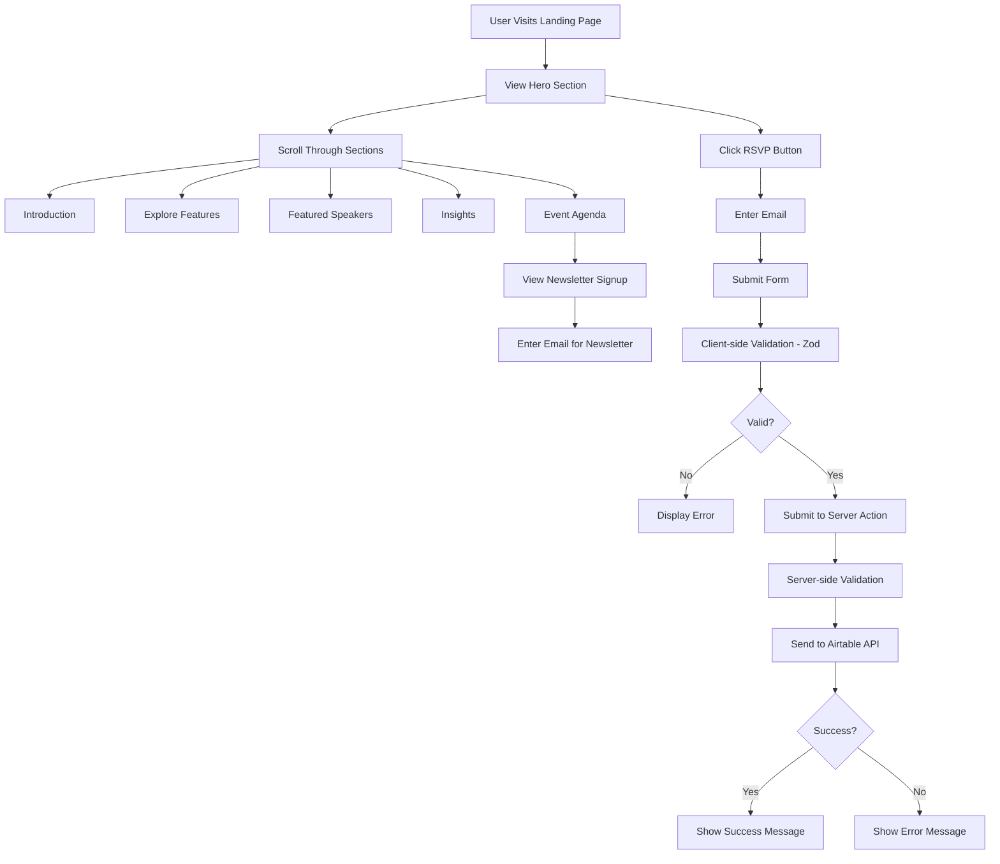

# SimpliLearn - Event Landing Page

A modern, responsive event landing page built with Next.js 16, featuring an interactive RSVP system with Airtable backend integration. This project showcases a professional event website with multiple sections including featured speakers, event agenda, insights, and a newsletter signup.

## 🎯 Project Overview

This is an event landing page designed to promote and manage RSVPs for a learning event. The application provides:

- **Landing Page**: Eye-catching hero section with event details
- **Introduction Section**: Overview of the event purpose
- **Explore Section**: Highlighted features and benefits
- **Featured Speakers**: Profiles of event speakers/experts
- **Insights Section**: Key topics and learning outcomes
- **Event Agenda**: Detailed schedule of activities
- **RSVP System**: Email-based registration with Airtable backend
- **Footer**: Additional information and social links

## 🚀 Tech Stack

### Core Framework
- **[Next.js 16.1.1](https://nextjs.org/)** - React framework with App Router
- **[React 19.2.3](https://react.dev/)** - UI library
- **[TypeScript 5](https://www.typescriptlang.org/)** - Type safety

### Styling
- **[Tailwind CSS v4](https://tailwindcss.com/)** - Utility-first CSS framework
- **[PostCSS](https://postcss.org/)** - CSS processing

### Backend & Data
- **[Airtable API](https://airtable.com/developers/web/api/introduction)** - Database for storing RSVPs
- **[Zod 4.3.5](https://zod.dev/)** - Schema validation

### Development Tools
- **ESLint** - Code linting
- **Next.js ESLint Config** - Next.js-specific linting rules

## 📁 Folder Structure

```
simplilearn/
├── app/                          # Next.js App Router directory
│   ├── actions/                  # Server Actions
│   │   └── rsvp.ts              # RSVP submission server action
│   │
│   ├── assets/                   # Static assets (images, icons)
│   │   └── [20 image/icon files]
│   │
│   ├── components/               # React components
│   │   ├── elements/            # Reusable UI elements
│   │   │   ├── SLButton.tsx    # Custom button component
│   │   │   └── SLInput.tsx     # Custom input component
│   │   │
│   │   ├── sections/            # Page sections
│   │   │   ├── EventAgendaSection.tsx      # Event schedule section
│   │   │   ├── ExploreSection.tsx          # Features section
│   │   │   ├── FeaturedSpeakersSection.tsx # Speakers showcase
│   │   │   ├── InsightsSection.tsx         # Key insights section
│   │   │   └── IntroductionSection.tsx     # Event intro section
│   │   │
│   │   ├── AgendaCard.tsx       # Individual agenda item card
│   │   ├── Expert.tsx           # Expert/speaker profile card
│   │   ├── ExploreCard.tsx      # Feature highlight card
│   │   ├── Footer.tsx           # Page footer
│   │   ├── LandingImage.tsx     # Hero section with RSVP form
│   │   ├── ListItem.tsx         # List item component
│   │   └── SendEmail.tsx        # Email newsletter signup form
│   │
│   ├── lib/                      # Utility libraries
│   │   ├── services/            # External service integrations
│   │   │   └── airtable.ts     # Airtable API service
│   │   ├── env.ts              # Environment variable validation
│   │   └── validations.ts      # Zod validation schemas
│   │
│   ├── favicon.ico              # Site favicon
│   ├── globals.css              # Global styles
│   ├── layout.tsx               # Root layout component
│   └── page.tsx                 # Home page
│
├── public/                       # Public static files
│   ├── file.svg
│   ├── globe.svg
│   ├── logo.svg
│   ├── next.svg
│   ├── vercel.svg
│   └── window.svg
│
├── .env / .env.local            # Environment variables (not in repo)
├── env.example                   # Environment variables template
├── eslint.config.mjs            # ESLint configuration
├── next.config.ts               # Next.js configuration
├── next-env.d.ts                # Next.js TypeScript declarations
├── package.json                 # Project dependencies
├── postcss.config.mjs           # PostCSS configuration
├── README.md                    # Project documentation
└── tsconfig.json                # TypeScript configuration
```

## 📂 Detailed Folder Purpose

### `/app` Directory
The main application directory using Next.js App Router architecture.

#### `/app/actions`
**Purpose**: Server Actions for backend logic
- `rsvp.ts`: Handles RSVP form submissions with validation and Airtable integration

#### `/app/assets`
**Purpose**: Store images, icons, and other static assets used throughout the application
- Contains 20+ visual assets for the landing page

#### `/app/components`
**Purpose**: All React components organized by type

##### `/app/components/elements`
**Purpose**: Reusable, low-level UI components
- `SLButton.tsx`: Custom styled button with hover effects and disabled states
- `SLInput.tsx`: Custom form input with validation styling

##### `/app/components/sections`
**Purpose**: Major page sections that compose the landing page
- `IntroductionSection.tsx`: Introduction to the event
- `ExploreSection.tsx`: Features and benefits grid
- `FeaturedSpeakersSection.tsx`: Speaker profiles showcase
- `InsightsSection.tsx`: Key learning topics
- `EventAgendaSection.tsx`: Event schedule timeline

##### Other Components
- `LandingImage.tsx`: Hero section with background image and RSVP CTA
- `Footer.tsx`: Site footer with contact info and links
- `SendEmail.tsx`: Newsletter subscription form
- `AgendaCard.tsx`: Card component for agenda items
- `Expert.tsx`: Speaker profile card
- `ExploreCard.tsx`: Feature highlight card
- `ListItem.tsx`: Generic list item component

#### `/app/lib`
**Purpose**: Shared utilities and helper functions

##### `/app/lib/services`
**Purpose**: External API integrations
- `airtable.ts`: Airtable service class for RSVP data management

##### Other Lib Files
- `env.ts`: Type-safe environment variable access with validation
- `validations.ts`: Zod schemas for form validation

### `/public` Directory
**Purpose**: Static assets served directly by Next.js (SVG icons, etc.)

### Configuration Files
- `next.config.ts`: Next.js framework configuration
- `tsconfig.json`: TypeScript compiler options
- `tailwind.config.ts`: Tailwind CSS customization (auto-generated in v4)
- `eslint.config.mjs`: Linting rules
- `postcss.config.mjs`: PostCSS plugins for Tailwind

## 🔄 Application Flow



## 🛠️ Setup Instructions

### Prerequisites
- Node.js 20+ installed
- An Airtable account with API access
- npm, yarn, pnpm, or bun package manager

### Installation

1. **Clone the repository**
```bash
git clone <repository-url>
cd simplilearn
```

2. **Install dependencies**
```bash
npm install
# or
yarn install
# or
pnpm install
```

3. **Configure Environment Variables**

Copy `env.example` to `.env.local`:
```bash
cp env.example .env.local
```

Fill in your Airtable credentials in `.env.local`:
```env
NEXT_PUBLIC_AIRTABLE_KEY=your_airtable_api_key
NEXT_PUBLIC_DATABASE_ID=your_airtable_base_id
NEXT_PUBLIC_BASE_URL=https://api.airtable.com/v0
```

**How to get Airtable credentials:**
- **API Key**: Go to [Airtable Account Settings](https://airtable.com/account) → Generate personal access token
- **Database ID**: Found in your Airtable base URL: `https://airtable.com/[BASE_ID]/...`
- Create a table named `RSVPSubmissions` with a field called `Email` (Single line text)

4. **Run the development server**
```bash
npm run dev
```

5. **Open your browser**
Navigate to [http://localhost:3000](http://localhost:3000)

## 🏗️ Build & Production

### Build for Production
```bash
npm run build
```

### Start Production Server
```bash
npm start
```

### Run Linter
```bash
npm run lint
```

## 🚀 Deployment

### Deploy on Vercel (Recommended)

1. Push your code to GitHub
2. Visit [Vercel](https://vercel.com/new)
3. Import your repository
4. Add environment variables in Vercel dashboard:
   - `NEXT_PUBLIC_AIRTABLE_KEY`
   - `NEXT_PUBLIC_DATABASE_ID`
   - `NEXT_PUBLIC_BASE_URL`
5. Deploy!

### Other Platforms
This Next.js application can be deployed to:
- **Netlify**: Install [@netlify/plugin-nextjs](https://www.netlify.com/with/nextjs/)
- **AWS Amplify**: Follow [Next.js deployment guide](https://docs.amplify.aws/guides/hosting/nextjs/)
- **Railway**: Direct deployment from GitHub
- **Self-hosted**: Use `npm run build` and `npm start`

## 🎨 Key Features

### 1. Server Actions
Uses Next.js 16 Server Actions for secure server-side RSVP processing without exposing API routes.

### 2. Type Safety
Full TypeScript implementation with Zod runtime validation for forms and environment variables.

### 3. Component Architecture
- **Atomic Design**: Elements → Components → Sections → Pages
- **Reusability**: Shared components in `/elements`
- **Separation of Concerns**: Section-based organization

### 4. Responsive Design
Mobile-first approach with Tailwind CSS responsive utilities.

### 5. Backend Integration
Clean service layer pattern for Airtable API integration with error handling.

## 📝 Environment Variables

| Variable | Description | Required |
|----------|-------------|----------|
| `NEXT_PUBLIC_AIRTABLE_KEY` | Your Airtable API key/token | Yes |
| `NEXT_PUBLIC_DATABASE_ID` | Your Airtable base ID | Yes |
| `NEXT_PUBLIC_BASE_URL` | Airtable API base URL | Yes |

> **Note**: Variables prefixed with `NEXT_PUBLIC_` are exposed to the browser.

## 🤝 Contributing

1. Fork the repository
2. Create a feature branch (`git checkout -b feature/amazing-feature`)
3. Commit your changes (`git commit -m 'Add amazing feature'`)
4. Push to the branch (`git push origin feature/amazing-feature`)
5. Open a Pull Request

## 📄 License

This project is created as an assignment for SimpliLearn.

## 🔗 Resources

- [Next.js Documentation](https://nextjs.org/docs)
- [React Documentation](https://react.dev)
- [Tailwind CSS Docs](https://tailwindcss.com/docs)
- [Airtable API Docs](https://airtable.com/developers/web/api/introduction)
- [Zod Documentation](https://zod.dev)
